<p align="center">
  
  
  
  
  
  
  
  
  
</p>

# 🌍 Unison — Multilingual Collaborative Workspace

<p align="center">
  <strong>Live app:</strong> <a href="https://unison-nine-swart.vercel.app">unison-nine-swart.vercel.app</a> &nbsp;&nbsp;|&nbsp;&nbsp;
  <strong>Repo:</strong> <a href="https://github.com/simplex-t/unison">github.com/simplex-t/unison</a>
</p>

> **Write in your language. Your teammates read in theirs.** Documents, chat, Kanban tasks, and UI — all translated in real time across 12 languages.

Unison is a full collaborative workspace where **language is context, not a barrier**. It combines **Git-inspired document branching**, **real-time translation** (Lingo.dev + DeepL), and **CRDT-based sync** (Yjs + Supabase) so global teams can work in their preferred language without copy-pasting through Google Translate.

---

## Demo
<iframe width="560" height="315" src="https://youtu.be/MVTW1IhFB1E" frameborder="0" allow="accelerometer; autoplay; clipboard-write; encrypted-media; gyroscope; picture-in-picture" allowfullscreen></iframe>

---

## 🎬 What Can You Do?

```
📄 Documents     → Rich text editor (TipTap + Yjs), branch-per-collaborator, translate on merge
💬 Chat          → Real-time channels with messages translated to each viewer’s language
📋 Kanban        → Boards with drag-and-drop tasks; titles/descriptions translated
🖼️ Whiteboards   → Infinite canvas (Tldraw), shared per workspace
🌐 UI            → 100+ strings in 12 languages, zero API calls (pre-bundled)
🔀 Merge flow    → Owner reviews translated branch preview → approve or reject → merge into main
```

---

## 🏗️ Architecture

```mermaid
graph TB
    User((User)) --> Auth["Supabase Auth"]
    Auth --> Workspace["Workspace<br/>Dashboard"]

    Workspace --> Docs["📄 Documents"]
    Workspace --> Chat["💬 Chat"]
    Workspace --> Board["📋 Kanban"]
    Workspace --> Whiteboard["🖼️ Whiteboards"]

    Docs --> Owner["Owner → main branch<br/>Y.Doc → documents.yjs_state"]
    Docs --> Collab["Collaborator → personal branch<br/>Y.Doc → document_branches.yjs_state"]
    Owner --> Realtime["Supabase Realtime<br/>yjs:docId:main"]
    Collab --> Realtime2["Supabase Realtime<br/>yjs:docId:branch:branchId"]
    Collab --> MR["Merge Request"]
    MR --> MergePanel["Merge Panel<br/>Translate → Preview → Merge"]
    MergePanel --> Lingo["lingo.dev SDK<br/>+ DeepL fallback"]
    Lingo --> Owner

    Chat --> Messages["messages table<br/>original_language"]
    Messages --> Realtime3["Supabase Realtime"]
    Messages --> Trans["useTranslation()<br/>3-layer cache"]

    Board --> Tasks["tasks table<br/>title_original_language"]
    Tasks --> Trans
    Trans --> Lingo
```



---

## 🌐 Translation Flow

```mermaid
graph LR
    UI["UI strings"] --> PreTrans["Pre-translated<br/>ui-strings.ts"]
    PreTrans --> useUI["useUITranslation()<br/>Zustand lang"]
    useUI --> UIOut["Instant UI in 12 langs"]

    UserContent["Doc / Chat / Task text"] --> Cache{"3-layer cache"}
    Cache -->|L1| Mem["In-memory Map"]
    Cache -->|L2| Supa["Supabase<br/>translation_cache"]
    Cache -->|L3| API["/api/translate"]
    API --> Lingo["lingo.dev SDK<br/>→ DeepL fallback"]
    Lingo --> Result["Translated content"]
    Mem --> Result
    Supa --> Result
```



- **Static UI:** 100+ keys × 12 languages bundled at build time → no network for labels, buttons, tooltips.
- **Dynamic content:** L1 in-memory → L2 Supabase cache → L3 Lingo.dev (with DeepL fallback). First view may call API; repeats are cache hits.

---

## 🔀 Document Branching (Git-Inspired)


- **Owner** edits `main` (one Y.Doc, channel `yjs:{docId}:main`).
- **Collaborators** get a personal branch per document (channel `yjs:{docId}:branch:{branchId}`). No character-level mixing of languages.
- **Merge:** translate branch content into document language → owner reviews in Merge Panel → merge into main.

---

## ✨ Key Features

| Feature | Description |
|--------|-------------|
| 📄 **Collaborative documents** | TipTap + Yjs CRDTs, real-time sync per branch, Supabase persistence |
| 🔀 **Branch-per-collaborator** | Each collaborator has own branch; submit for review → translate → merge |
| 💬 **Chat with translation** | Messages stored with `original_language`; viewers see translation in their language |
| 📋 **Kanban boards** | Drag-and-drop (@hello-pangea/dnd), tasks with translated title/description |
| 🖼️ **Whiteboards** | Tldraw infinite canvas, state in Supabase |
| 🌐 **12-language UI** | Pre-translated strings; language switcher; no runtime translation for UI |
| 🔐 **Per-document access** | Invite by user; roles (editor/viewer); RLS on documents, branches, merge_requests |
| 🤖 **AI merge assist** | Optional Gemini-based suggestions for merging branch content |
| 📡 **Realtime** | Supabase Realtime for docs, branches, merge requests, chat, notifications |

---

## 🛠️ Tech Stack

| Layer | Technologies |
|-------|--------------|
| **Frontend** | Next.js 16, React 19, TypeScript, Tailwind CSS 4, Motion, Lucide |
| **Documents** | TipTap, Yjs, y-tiptap; custom Supabase Yjs provider |
| **Translation** | [lingo.dev](https://lingo.dev) SDK (primary), DeepL (fallback), 3-layer cache |
| **Data & realtime** | Supabase (Auth, PostgreSQL, RLS, Realtime) |
| **Whiteboard** | Tldraw |
| **State** | Zustand (user, workspace, preferred language) |
| **Drag & drop** | @hello-pangea/dnd (Kanban) |
| **AI (optional)** | Google Gemini (merge suggestions) |

---

## 🚀 Getting Started

### Prerequisites

- **Node.js 18+** and **npm** (or bun)
- [Supabase project](https://supabase.com)
- [lingo.dev API key](https://lingo.dev) (DeepL optional for fallback)

### 1. Clone the repository

```bash
git clone https://github.com/simplex-t/unison.git
cd unison
```

### 2. Install dependencies

```bash
npm install
```

### 3. Set up Supabase

1. Create a project at [supabase.com](https://supabase.com).
2. In the SQL Editor, run the migrations in order from `supabase/migrations/` (e.g. `001_initial_schema.sql` through `011_realtime_comments.sql`).
3. Enable the auth providers you need (e.g. Email/Password, OAuth).

### 4. Environment variables

Copy the example env and fill in your values:

```bash
cp .env.example .env.local
```

Edit `.env.local`:

```env
# Supabase (Settings → API)
NEXT_PUBLIC_SUPABASE_URL=https://your-project.supabase.co
NEXT_PUBLIC_SUPABASE_ANON_KEY=your-anon-key

# Translation
LINGO_API_KEY=your-lingo-api-key
DEEPL_API_KEY=your-deepl-api-key   # optional fallback
```

Optional (for AI merge suggestions):

```env
GEMINI_API_KEY=your-gemini-api-key
```

### 5. Run the app

```bash
npm run dev
```

Open [http://localhost:3000](http://localhost:3000) → sign in → create or join a workspace → create documents, boards, channels, or whiteboards.

---

## 🌐 Supported Languages (12)

| | | | |
|--|--|--|--|
| 🇬🇧 English | 🇯🇵 日本語 | 🇪🇸 Español | 🇫🇷 Français |
| 🇩🇪 Deutsch | 🇧🇷 Português | 🇨🇳 中文 | 🇰🇷 한국어 |
| 🇸🇦 العربية | 🇮🇳 हिन्दी | 🇷🇺 Русский | 🇮🇹 Italiano |

---

## 📜 API / Core Routes

| Method | Route | Description |
|--------|------|-------------|
| `POST` | `/api/translate` | Translate text (Lingo.dev → DeepL fallback); used by frontend cache |
| `GET/POST` | `/api/documents/[docId]/branches` | List or create branches for a document |
| `POST` | `/api/documents/[docId]/merge` | Submit for merge, approve, or reject |
| `POST` | `/api/documents/[docId]/sync` | Sync main into a branch (Yjs merge) |
| `GET/POST` | `/api/documents/[docId]/invite` | Invite/revoke document collaborators |
| `POST` | `/api/documents/[docId]/ai-review` | Optional Gemini merge suggestion |
| `POST` | `/api/documents/[docId]/delete` | Delete or leave document |
| `GET` | `/api/notifications` | User notifications |
| `POST` | `/api/workspace/invite` | Workspace invite link |

---

## 🗄️ Database (main concepts)

| Table / concept | Purpose |
|-----------------|---------|
| `profiles` | User profile, `preferred_language` |
| `workspaces`, `workspace_members` | Workspaces and roles (owner/admin/member) |
| `documents` | Document metadata + `yjs_state` (main branch) |
| `document_access` | Per-document invites (editor/viewer) |
| `document_branches` | Collaborator branches + `yjs_state` |
| `merge_requests` | Pending/merged/rejected merge state |
| `document_comments` | Comments on documents |
| `channels`, `messages` | Chat; `messages.original_language` for translation |
| `boards`, `board_columns`, `tasks` | Kanban; tasks store `title_original_language`, etc. |
| `whiteboards` | Whiteboard metadata + `tldraw_state` |
| `notifications` | In-app notifications |
| `translation_cache` | Cached translations (L2) |

All sensitive tables use **Row-Level Security** so users only see data they’re allowed to.

---

## 🙏 Credits

| Technology | What it powers |
|------------|----------------|
| [**lingo.dev**](https://lingo.dev) | Primary translation (12 languages) |
| [**Supabase**](https://supabase.com) | Auth, PostgreSQL, Realtime |
| [**Yjs**](https://yjs.dev) | CRDTs for collaborative documents |
| [**TipTap**](https://tiptap.dev) | Rich text editor |
| [**Tldraw**](https://tldraw.dev) | Whiteboard canvas |
| [**DeepL**](https://www.deepl.com) | Optional translation fallback |
| [**Google Gemini**](https://ai.google.dev) | Optional AI merge suggestions |

---

## 📄 License

MIT License — see [LICENSE](LICENSE).

---

## 🤝 Contributing

1. Fork → 2. Branch (`feature/your-feature`) → 3. Commit → 4. Push → 5. Open a Pull Request.

---

<p align="center">
  <strong>Built with ❤️ by devtochukwu</strong>
  <br/>
  <sub>Powered by lingo.dev • Supabase • Yjs • TipTap • Tldraw</sub>
</p>
